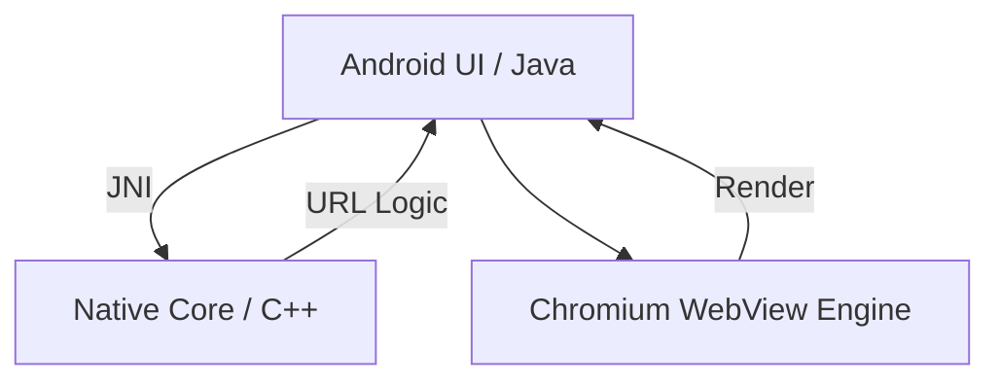

# Velocity Browser 🚀

Velocity is a high-performance, professional-grade Android web browser built on a hybrid architecture of **Java** and **Native C++**. It combines the versatility of the Android Material Design system with the raw processing speed of a C++ core engine via the Android NDK (JNI).

## 🌟 Key Features

### ⚡ Native C++ Processing Engine
The heart of Velocity's URL and logic processing is written in **C++**. This ensures rapid string manipulation and lightning-fast determination of user intent, whether it's a search query or a direct URL.

### 📑 Multi-Tab Architecture
Manage your workflow like a pro. Velocity supports a fully isolated multi-tab system where each tab maintains its own state, scrolling position, and browsing history.

### 🌓 Modern Aesthetics & Dark Mode
- **Adaptive UI**: A sleek, Chrome-inspired interface that supports system-wide Dark Mode.
- **Algorithmic Darkening**: Injected native logic that darkens websites even if they don't have a native dark theme.
- **Dynamic Icons**: High-contrast, tinted iconography that adapts to your theme for maximum legibility.

### ⚙️ Professional Browser Infrastructure
- **Advanced Caching**: Intelligent `LOAD_DEFAULT` caching strategies for near-instant page reloads.
- **Data Persistence**: Full support for DOM Storage, IndexedDB, and Web SQL.
- **System Integration**: Fully compatible with Android Intents. Set Velocity as your default browser and open links from any app.
- **Deep Hand-off**: Automatically handles external protocols like `tel:`, `mailto:`, and `maps:`.

---

## 🏗️ Technical Architecture

- **Native Tier**: C++17 logic compiled with CMake.
- **Application Tier**: Java with AndroidX and Material Components.
- **Build System**: Gradle with Ninja/CMake for native compilation.

---

## 🛠️ Build & Installation

### Prerequisites
- **Android Studio** (Koala or newer recommended)
- **Android NDK** (v25.1.8937393 or newer)
- **CMake** (v3.22.1 or newer)

### Building from Source
1. Clone the repository.
2. Open the project in Android Studio.
3. Sync Gradle and ensure NDK components are downloaded.
4. Select `app` run configuration and click **Run**.

---

## 📅 Roadmap

- [ ] **Velocity Ad-Block**: Integrated native C++ content filtering.
- [ ] **Privacy Guard**: Incognito mode and tracker blocking.
- [ ] **Cloud Sync**: Cross-device syncing of tabs and bookmarks.
- [ ] **Extension API**: Support for WebExtensions.

---

## 📄 License
This project is licensed under the MIT License - see the [LICENSE](LICENSE) file for details.

---

Built with ❤️ by the Velocity Team.
