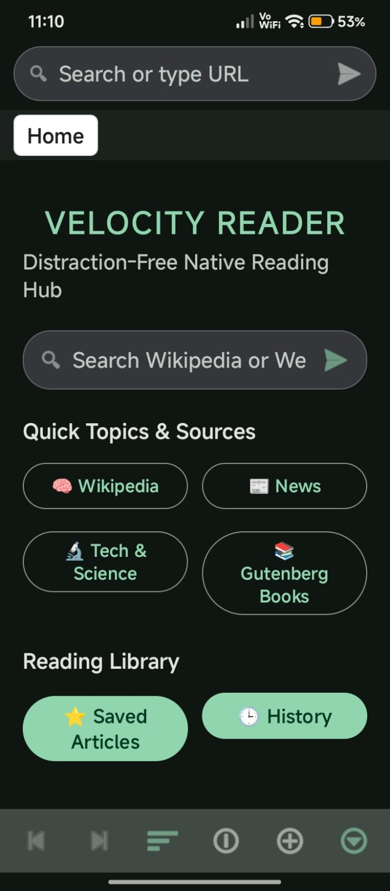
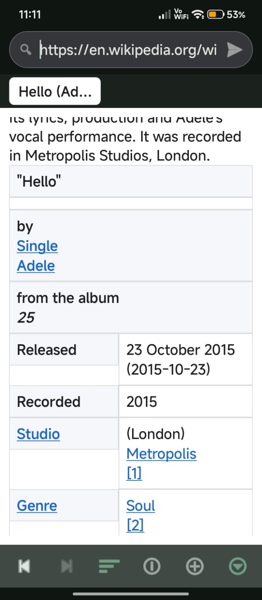
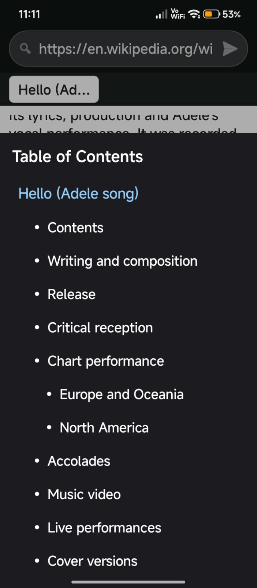
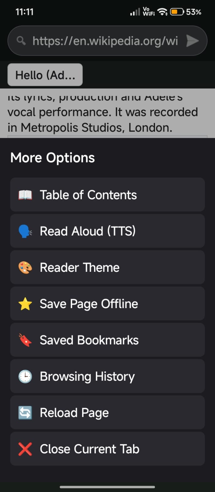

# Velocity Reader

**Velocity** is an open-source, distraction-free native Android browser and article reconstruction engine built for fast, clean, offline-capable reading.

---

## 📱 Screenshots

| Home Reading Hub | Article Reader View | Table of Contents | More Options Sheet |
| :---: | :---: | :---: | :---: |
|  |  |  |  |

---

## ✨ Features

- 📖 **Native Layout Reconstruction Engine**: Parses raw web content and renders distraction-free native Android components (`TextView`, `ImageView`, `TableLayout`, `LinearLayout`) without webview bloat.
- 🗣️ **Text-to-Speech (Read Aloud)**: Integrated native Android TTS engine to read articles out loud.
- 📑 **Table of Contents (Article Outline)**: Automatic structure extraction to jump to headings (`H1`-`H6`) instantly.
- 🎨 **Multiple Reader Themes**:
  - **Light**
  - **Sepia**
  - **OLED Dark**
  - **Material Dark**
- ⚡ **Lightweight QuickJS Engine**: Executes essential lightweight scripts securely in a sandboxed C environment via CashApp QuickJS.
- 🔖 **Offline Bookmarks & Storage**: Save complete reconstructed articles for offline reading.
- 🕒 **Browsing History**: Persistent JSON history management with deduplication and history clearing.
- 📐 **High-Contrast Dark Mode Tables**: High-contrast, theme-adaptive table styling with full text selection support.
- 🎨 **Material 3 UI**: Clean bottom navigation controls and modern bottom sheet options.

---

## 🛠️ Architecture

- **`MainActivity.java`**: Core tab orchestrator, navigation handlers, and view management.
- **`WebsiteReconstructionEngine.java`**: Orchestrates HTML cleaning and native layout tree compilation.
- **`HtmlCleaner.java`**: Strips trackers, ad scripts, popups, and non-essential DOM bloat.
- **`NativeLayoutRenderer.java`**: Translates layout nodes into optimized native Android view trees.
- **`ArticleOutlineExtractor.java`**: Extracts article headings into an interactive Table of Contents outline.
- **`BookmarkManager.java`**: Manages offline JSON bookmark metadata and cached article storage.
- **`HistoryManager.java`**: Handles persistent JSON browsing history tracking.
- **`ImageLoader.java`**: Handles image caching, memory/disk management, and protocol-relative URL resolving.

---

## 📦 Building from Source

### Prerequisites
- Android Studio Ladybug (or newer) / JDK 17+
- Android SDK 36 (minSdk 24)

### Build Commands
```bash
# Debug Build
./gradlew assembleDebug

# Release Build (R8 Minified)
./gradlew assembleRelease
```

---
## Buy me a coffee

If you want to support the developer:

 [](https://paypal.me/diekaiju)


## 📄 License
Licensed under the [MIT License](LICENSE).
